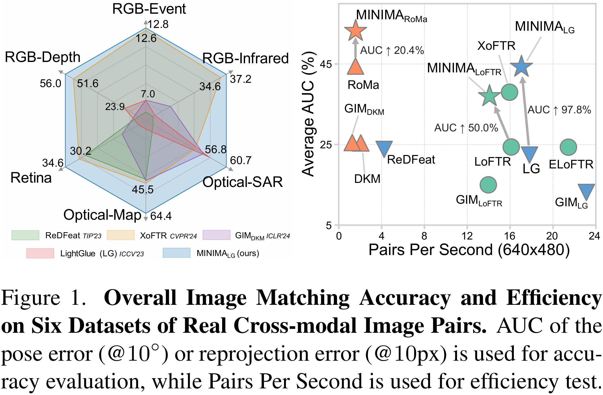
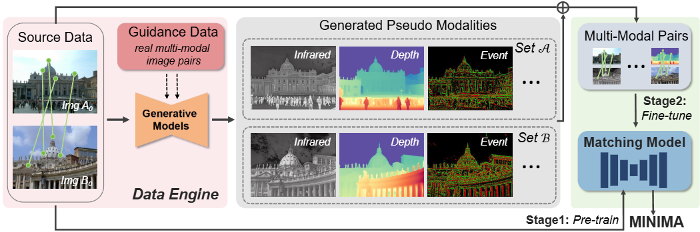

<h1 align="center"> MINIMA: Modality Invariant Image Matching </h1>

<div align="center">

[Xingyu Jiang](https://scholar.google.com/citations?user=h2W90MQAAAAJ&hl=en&oi=ao)<sup>1</sup>,
[Jiangwei Ren](https://github.com/LSXI7)<sup>1</sup>,
[Zizhuo Li](https://scholar.google.com/citations?user=bxuEALEAAAAJ&hl=en&oi=ao)<sup>2</sup>,
[Xin Zhou](https://lmd0311.github.io/)<sup>1</sup>,
[Dingkang Liang](https://dk-liang.github.io/)<sup>1</sup>
and [Xiang Bai](https://scholar.google.com/citations?user=UeltiQ4AAAAJ&hl=en)<sup>1†</sup>

<sup>1</sup> Huazhong University of Science & Technology, <sup>2</sup> Wuhan University.         
(†) Corresponding author.

</div>

[//]: # (This repository represents the official implementation of the paper titled "MINIMA: Modality Invariant Image Matching".)

<div align="center">

<a href="https://arxiv.org/abs/2412.19412"></a>
<a href="https://huggingface.co/spaces/lsxi77777/MINIMA"></a>
<a href="https://www.apache.org/licenses/LICENSE-2.0"></a>
<a href="https://openxlab.org.cn/datasets/lsxi7/MINIMA"></a>

</div>

<div align="center">


</div>

## 📣 News

- **[27/Dec/2024]** [Arvix version](https://arxiv.org/abs/2412.19412) is released.
- **[26/Dec/2024]** Release the code and checkpoint.

## Abstract

Image matching for both cross-view and cross-modality plays a critical role in multimodal perception. In practice, the
modality gap caused by different imaging systems/styles poses great challenges to the matching task. Existing works try
to extract invariant features for specific modalities and train on limited datasets, showing poor generalization. In
this paper, we present MINIMA, a unified image matching framework for multiple cross-modal cases. Without pursuing fancy
modules, our MINIMA aims to enhance universal performance from the perspective of data scaling up. For such purpose, we
propose a simple yet effective data engine that can freely produce a large dataset containing multiple modalities, rich
scenarios, and accurate matching labels. Specifically, we scale up the modalities from cheap but rich RGB-only matching
data, by means of generative models. Under this setting, the matching labels and rich diversity of the RGB dataset are
well inherited by the generated multimodal data. Benefiting from this, we construct MD-syn, a new comprehensive dataset
that fills the data gap for general multimodal image matching. With MD-syn, we can directly train any advanced matching
pipeline on randomly selected modality pairs to obtain cross-modal ability. Extensive experiments on in-domain and
zero-shot matching tasks, including 19 cross-modal cases, demonstrate that our MINIMA can significantly outperform the
baselines and even surpass modality-specific methods.

<p align="center">
   &nbsp;&nbsp;&nbsp;&nbsp;
  
</p>

## Our Framework

<div align="center">



</div>

## Online Demo

* Visit our demo
  <a href="https://huggingface.co/spaces/lsxi77777/MINIMA"></a>,
  and test our MINIMA models.
* Special thanks to [Hugging Face](https://huggingface.co/) for providing the ZeroGPU support for this project!

## Full MegaDepth-Syn Dataset

* The MegaDepth-Syn Dataset is generated from the [MegaDepth dataset](https://www.cs.cornell.edu/projects/megadepth/)
  using our
  MINIMA data engine, which contains for extra 6 modalities: infrared, depth, event, normal, sketch, and paint.
* Full dataset is released
  in <a href="https://openxlab.org.cn/datasets/lsxi7/MINIMA"></a>.
* You can download the dataset using the following command:

```bash
pip install openxlab --no-dependencies #Install

openxlab login # Log in and enter the corresponding AK/SK. Please view AK/SK at usercenter

openxlab dataset info --dataset-repo lsxi7/MINIMA # Dataset information viewing and View Dataset File List

openxlab dataset get --dataset-repo lsxi7/MINIMA #Dataset download

openxlab dataset download --dataset-repo lsxi7/MINIMA --source-path /README.md --target-path /path/to/local/folder #Dataset file download
```

And more details can be found
in <a href="https://openxlab.org.cn/datasets/lsxi7/MINIMA/cli/main"></a>.

## Weight Download

* We provide our `minima_lightglue`,`minima_loftr` and `minima_roma` model weight
  in [Google Drive](https://drive.google.com/drive/folders/16kZfehtXeIu6fJjUoYDzYb-3FkZBpkNd?usp=sharing).
* Also we provide github link for the
  weights: [minima_lightglue](https://github.com/LSXI7/storage/releases/download/MINIMA/minima_lightglue.pth),
  [minima_loftr](https://github.com/LSXI7/storage/releases/download/MINIMA/minima_loftr.ckpt)
  and [minima_roma](https://github.com/LSXI7/storage/releases/download/MINIMA/minima_roma.pth).
* Please download the weight files and put it in the `weights` folder.
* Or you can directly run:

```bash
bash weights/download.sh 
```

## Data Preparation for Evaluation

We are grateful to the authors for their contribution of the testing datasets of the real multimodal scenarios.

<p></p> <details> <summary><b> MegaDepth-1500-Syn </b></summary>     

We provide a bash command to download the dataset and organize the MegaDepth-1500-Syn dataset directly:

```bash
bash data/test_data_preparation.sh
```

Additional, please download the
original [megadepth-1500](https://drive.google.com/drive/folders/1nTkK1485FuwqA0DbZrK2Cl0WnXadUZdc), and run:

```bash
tar xf megadepth_test_1500.tar
ln -s /path/to/megadepth_test_1500/Undistorted_SfM  /path/to/MINMA/data/megadepth/test
```

</details>
<p></p>

<p></p> <details> <summary><b> RGB-Infrared Test Dataset </b></summary>  

The METU-VisTIR dataset comes from [XoFTR](https://github.com/OnderT/XoFTR?tab=readme-ov-file), and is available
at its official [Google Drive](https://drive.google.com/file/d/1Sj_vxj-GXvDQIMSg-ZUJR0vHBLIeDrLg/view).        
For more information, please refer to the [XoFTR](https://github.com/OnderT/XoFTR?tab=readme-ov-file).

</details>
<p></p>

<p></p> <details> <summary><b> MMIM Test Dataset </b></summary>  

MMIM Dataset is sourced
from [Multi-modality-image-matching-database-metrics-methods](https://github.com/StaRainJ/Multi-modality-image-matching-database-metrics-methods).      
We prepare necessary JSON files with Multi-modality-image-matching-database-metrics-methods.zip file, located in the
data directory.
.     
To set up the
MMIM test dataset, please follow these steps:

```bash
cd data
git clone https://github.com/StaRainJ/Multi-modality-image-matching-database-metrics-methods.git
unzip -o Multi-modality-image-matching-database-metrics-methods.zip
```

</details>
<p></p>

<p></p> <details> <summary><b> RGB-Depth Test Dataset </b></summary>  

The Depth Dataset comes from the [DIODE](https://diode-dataset.org/) dataset.     
You can directly download the dataset from its
official [Amazon Web Service](http://diode-dataset.s3.amazonaws.com/val.tar.gz)
or [Baidu Cloud Storage](https://pan.baidu.com/s/18IoX7f9W3F7acP0hjl7NSA).

</details>
<p></p>


<p></p> <details> <summary><b> RGB-Event Test Dataset </b></summary>

The aligned RGB-Event test dataset is generated from [DSEC](https://dsec.ifi.uzh.ch/).        
Our test data can be downloaded
from [Google Drive](https://drive.google.com/drive/folders/1rYKwI4Jmw1WAw_zRfHndph8AgyHZqdss?usp=sharing).

</details>
<p></p>

### Data Structure

<p></p> <details> <summary><b>Organizing the Dataset</b></summary>     

We recommend organizing the datasets in the following folder structure:

```
data/
├── METU-VisTIR/
│ ├── index/
│ └── ...
├── Multi-modality-image-matching-database-metrics-methods/
│ ├── Multimodal_Image_Matching_Datasets/
│ └── ...
├── megadepth/
│ └── train/[modality]/Undistorted_SfM/
└── DIODE/
│ └── val/
└── DSEC/
  ├── vent_list.txt
  ├── thun_01_a/
  └── ...
```

</details>
<p></p>

# Installation and Environment Setup

* Clone the repository:

```bash
git https://github.com/LSXI7/MINIMA.git
cd MINIMA
conda env create -f environment.yaml
conda activate minima
```

* Initialize the external submodule dependencies with:

```bash
git submodule update --init --recursive
git submodule update --recursive --remote
sed -i '1s/^/from typing import Tuple as tuple\n/' third_party/RoMa/romatch/models/model_zoo/__init__.py
```

* Run demo code after downloading the [weights](#weight-download):

```bash
python demo.py --method sp_lg --fig1 demo/vis_test.png --fig2 demo/depth_test.png --save_dir ./demo
```

# Multimodal Image Matching Evaluation

We provide the multi-modality image matching benchmark commands for our MINIMA models.
Choose the method from `sp_lg`, `loftr`, `roma` and `xoftr` for the multimodal evaluation.

### Test on Real Multimodal Datasets

```bash
python test_relative_pose_infrared.py --method <method> <--ckpt model_path> <--save_figs> <--save_dir save_dir>  # Infrared-RGB

python test_relative_homo_depth.py    --method <method> <--ckpt model_path> <--save_figs> <--save_dir save_dir>  # Depth-RGB

python test_relative_homo_event.py    --method <method> <--ckpt model_path> <--save_figs> <--save_dir save_dir>  # Event-RGB

# choose_model: 0 for medical test, 1 for remote sensing test
python test_relative_homo_mmim.py     --method <method> <--ckpt model_path> --choose_model 0/1 <--save_figs> <--save_dir save_dir>
```

### Test on MD-syn Dataset

```bash
python test_relative_pose_mega_1500_syn.py  --method <method> <--ckpt ckpt> --multi_model <modality> <--save_figs> <--save_dir save_dir>
# modality: infrared/depth/event/normal/sketch/paint
```

### Test on Origin MegaDepth-1500 Dataset

```bash
python test_relative_pose_mega_1500.py  --method <method> <--ckpt model_path> <--save_figs> <--save_dir save_dir>
```

Note: By default, the checkpoint is initialized from the MINIMA models in the `weights` folder, and you can specify a
custom checkpoint using the `--ckpt` argument.

## TODO List

- [x] MD-Syn Full Dataset
- [x] Real Multimodal Evaluation Benchmark
- [x] Synthetic Multimodal Evaluation Benchmark
- [ ] Training Code
- [ ] Our MINIMA Data Engine for Multimodal Data Generation
- [ ] More Modalities Addition

## Acknowledgement

We sincerely thank the
[SuperPoint](https://github.com/magicleap/SuperPointPretrainedNetwork),
[LightGlue](https://github.com/cvg/LightGlue),
[Glue Factory](https://github.com/cvg/glue-factory),
[LoFTR](https://github.com/zju3dv/LoFTR),
[RoMa](https://github.com/Parskatt/RoMa)
for their contribution of methodological development.    
Additionally, we appreciate the support of [MegaDepth](https://www.cs.cornell.edu/projects/megadepth/) and
[SCEPTER](https://github.com/modelscope/scepter),
[Depth-Anything-V2](https://github.com/DepthAnything/Depth-Anything-V2),
[DSINE](https://github.com/baegwangbin/DSINE),
[PaintTransformer](https://github.com/Huage001/PaintTransformer),
[Anime2Sketch](https://github.com/Mukosame/Anime2Sketch) for their role in data generation.

## Citation

If you find our work useful in your research, please consider giving a star ⭐ and a citation

```bibtex
@article{jiang2024minima,
  title={MINIMA: Modality Invariant Image Matching},
  author={Jiang, Xingyu and Ren, Jiangwei and Li, Zizhuo and Zhou, Xin and Liang, Dingkang and Bai, Xiang},
  journal={arXiv preprint arXiv:2412.19412},
  year={2024},
}
```
